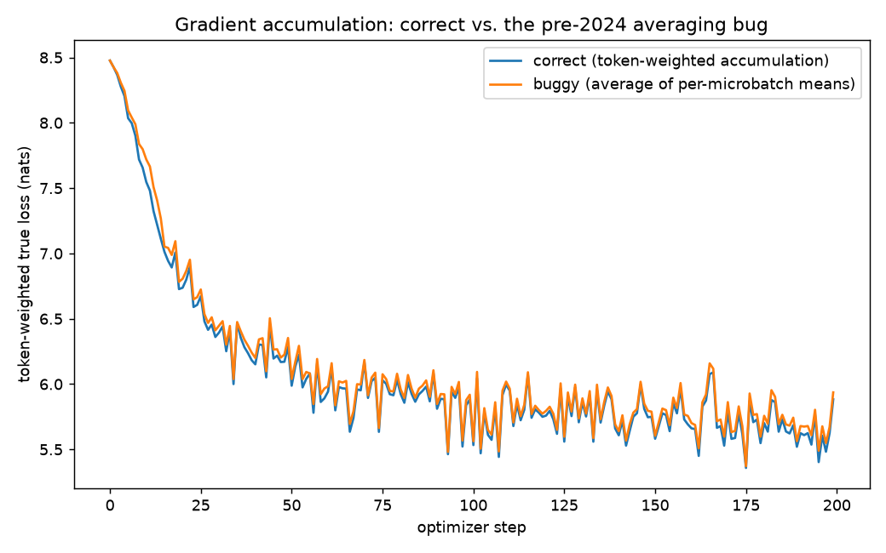
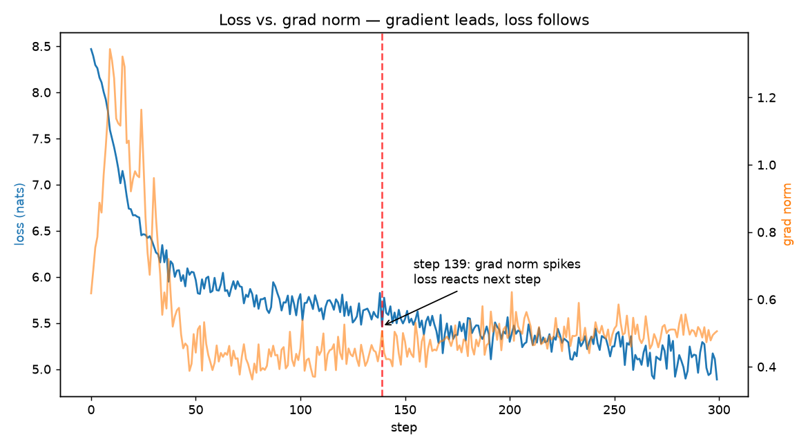
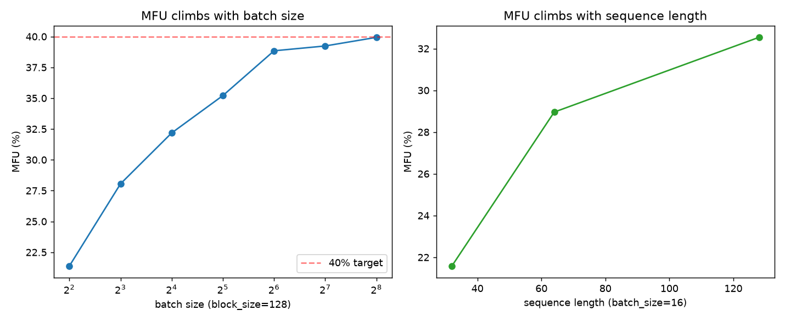

# Loss, Gradients, and Number Formats — a small model tells the truth about itself

This README is the primary artifact. Every number below is **measured** — produced by
executing `s10_loss_and_gradients.ipynb` top to bottom, written to `submission_artifacts/`,
and never hand-edited into this file.

## What this proves, in one command

```bash
cd s10
python3 -m venv .venv
.venv/bin/pip install torch tokenizers matplotlib jupyter nbformat nbclient ipykernel numpy
.venv/bin/python -m ipykernel install --user --name s10-loss-and-gradients --display-name "s10-loss-and-gradients"
.venv/bin/jupyter nbconvert --to notebook --execute \
    --ExecutePreprocessor.kernel_name=s10-loss-and-gradients \
    --ExecutePreprocessor.timeout=600 \
    --output s10_loss_and_gradients.ipynb s10_loss_and_gradients.ipynb
```

No network calls beyond `pip install` — `data/tinyshakespeare.txt` is committed to the repo,
and the byte-level BPE tokenizer is trained from it locally each run. This regenerates
`submission_artifacts/`:

- `s10_numbers.json` — every number in the tables below, in one place.
- `grad_accum_losses.json`, `grad_accum_bug.png` — the Part D correct-vs-buggy loss curves.
- `grad_norm_log.json`, `grad_norm_lead_lag.png` — the Part E per-step loss/grad-norm trace.
- `mfu_sweep.png` — the Extension 2 MFU-vs-batch-size / MFU-vs-sequence-length curves.
- `artifacts/tokenizer-vocab.json`, `artifacts/tokenizer-merges.txt` — the trained tokenizer.

Notebook: [`s10_loss_and_gradients.ipynb`](s10_loss_and_gradients.ipynb) — runs top to bottom
on CUDA, MPS (Apple Silicon), or CPU. Executed here on Apple Silicon (`mps` backend, M1 Pro,
14-core GPU).

## Model

A ~5.2M-parameter decoder-only transformer (`TinyGPT` in the notebook): RMSNorm (pre-norm),
SwiGLU feed-forward, causal self-attention, 4 layers, 4 heads, `d_model=256`,
`block_size=128`. Tokenizer: byte-level BPE trained from scratch on
`data/tinyshakespeare.txt`, vocab size 4000. Small enough that every experiment below runs
in well under a minute; big enough that the effects being measured (gradient bias, grad-norm
spikes, MFU) are real signal, not noise.

## B — tensor shapes, one line per dimension

Forward pass on a `(4, 128)` batch, traced inline (notebook §B):

| Tensor | Shape | Meaning |
|---|---|---|
| `tokens` | `(4, 128)` | `B`=batch size (independent sequences), `T`=sequence position (index into the context window) |
| `token+pos embedding` | `(4, 128, 256)` | `(B, T, D)`, `D`=hidden/model dimension — feature vector per token+position |
| `q, k, v` | `(4, 4, 128, 64)` | `(B, n_head, T, head_dim)`, `head_dim = D / n_head` — one slice of the embedding per attention head |
| `attention scores` | `(4, 4, 128, 128)` | `(B, n_head, T_query, T_key)` — how much each query position attends to each key position |
| `hidden` (after 4 blocks + final norm) | `(4, 128, 256)` | `(B, T, D)` — unchanged shape throughout the residual stream |
| `logits` | `(4, 128, 4000)` | `(B, T, V)`, `V`=vocab size — one un-normalized score per possible next token, per position |

## C — verify one gradient by hand

Picked one scalar weight (`blocks[0].mlp.w2.weight[3,7]`), computed the analytic gradient via
`backward()`, then independently perturbed that weight by `±eps` and took the central finite
difference `(loss(w+eps) - loss(w-eps)) / (2·eps)`.

**Naive attempt, fp32** (the model's native dtype) — analytic grad `-2.3567e-4`:

| eps | numeric grad | abs diff vs. analytic |
|---|---|---|
| 1e-1 | -2.2888e-4 | 6.79e-6 |
| 1e-2 | -1.9073e-4 | 4.49e-5 |
| 1e-3 | **0.0** | 2.36e-4 (100% relative error) |
| 1e-4 | **0.0** | 2.36e-4 |
| 1e-5 | **0.0** | 2.36e-4 |

At `eps ≤ 1e-3` the numeric gradient collapses to exactly zero — a 100% disagreement with
`backward()`. That is the assignment's warning made real: "if they do not agree, you have
found something worth understanding." What's actually going on isn't an autograd bug — it's
catastrophic cancellation in the *check itself*. `loss(w+eps)` and `loss(w-eps)` are both
~8.7, differing only in their 6th–7th significant digit (since the true gradient is
`~2.4e-4`), and fp32 carries only ~7 significant decimal digits. Subtracting them erases the
whole signal.

**Fix: run the perturbation in fp64** — analytic grad `-2.356687819e-4`:

| eps | numeric grad | rel diff vs. analytic |
|---|---|---|
| 1e-2 | -2.356687683e-4 | 5.77e-8 |
| 1e-3 | -2.356687814e-4 | 2.28e-9 |
| **1e-4** | **-2.356687823e-4** | **1.49e-9** |
| 1e-5 | -2.356688178e-4 | 1.52e-7 |
| 1e-6 | -2.356674855e-4 | 5.50e-6 |
| 1e-7 | -2.356781437e-4 | 3.97e-5 |

Best agreement at `eps=1e-4`: relative error `1.49e-9`, i.e. **~8.8 matching significant
digits**, with the textbook U-shaped finite-difference error curve on either side (too-large
`eps` costs accuracy to curvature; too-small `eps` costs it back to cancellation).
`backward()` was correct the entire time — the naive fp32 check was the thing lying.

## D — break gradient accumulation on purpose

The bug (present in framework example scripts until it was diagnosed publicly in 2024): when
microbatches have different numbers of *valid* (non-padded / non-masked) tokens, accumulating
gradients by averaging each microbatch's own mean loss — `mean(loss_i for i in microbatches)`
— gives every microbatch equal weight regardless of how many real tokens it contributed. The
fix weights each microbatch by its *share of the total valid tokens in the optimizer step*.

Two models, identical init/data/padding schedule (only the accumulation arithmetic differs),
200 optimizer steps, each accumulating over 2 microbatches with deliberately different
valid-token counts drawn from `{8, 16, 112, 128}` out of a 128-token block:

| | correct (token-weighted) | buggy (average of means) |
|---|---|---|
| final loss (step 200) | **5.8832** | **5.9366** |
| mean gap over run | — | **+0.0477** nats |
| mean gap, last 50 steps | — | **+0.0510** nats |
| steps where buggy loss is worse | — | **198 / 200 (99%)** |



The buggy curve sits visibly above the correct one for essentially the entire run. It doesn't
crash or emit a NaN — it just quietly trains a slightly worse model, exactly as the 2024
discovery described.

## E — grad norm every step: gradient moves before loss does

300-step run, grad norm clipped to 1.0 (pre-clip norm logged), 35,908 tokens/sec. Scanned for
steps where grad norm spikes (z-score > 3 against a trailing 10-step window) while that same
step's loss doesn't move — 9 such spikes found. The clearest lead-lag example:

| step | grad-norm z-score | grad norm | Δloss at this step | Δloss at next step |
|---|---|---|---|---|
| **139** | 3.38 | 0.506 | **-0.362** (still falling) | **+0.310** (jumps up) |



At step 139 the grad norm is a clear outlier against its own recent history while the loss is
still falling — the loss doesn't show the corresponding jump until the *next* step. A grad-norm
monitor would have flagged trouble one full step before the loss curve did.

## F — compute your own MFU, honestly

`MFU = achieved FLOPs / peak FLOPs`. Achieved FLOPs uses the standard `6·N·tokens_per_second`
approximation (`N`=params; forward+backward ≈ 6N FLOPs/token). Peak FLOPs on this machine (an
Apple M1 Pro, 14-core GPU) is estimated from Apple's published FP32 figure for the *full*
16-core M1 Pro GPU (5.2 TFLOPS), scaled linearly: `5.2 × 14/16 ≈ 4.55 TFLOPS` — flagged
explicitly as an estimate, since Apple doesn't publish a per-core datasheet number the way
Nvidia does, and this GPU has no dedicated bf16/fp16 tensor cores to begin with.

| | value |
|---|---|
| params (N) | 5,226,752 |
| tokens/sec (measured) | 35,908 |
| achieved FLOPs/s | 1.126e12 (1.126 TFLOPS) |
| peak FLOPs/s (estimate) | 4.550e12 (4.550 TFLOPS) |
| **MFU** | **24.75%** |

**Honest reading — nowhere near a healthy 40%, and here's what I believe is costing that
distance.** A ~5M-parameter model with a batch of 16×128=2,048 tokens spends most of its
wall-clock time on fixed overhead that has nothing to do with FLOPs: Python-level dispatch
per operator, MPS kernel-launch latency, and CPU↔GPU sync for `.item()` calls in the logging
loop — none of which shrinks as the model gets bigger, so it dominates at this scale. The
attention here is also a naive, unfused `q@k.T → mask → softmax → @v` implementation with no
flash-attention-style kernel fusion — on real hardware that's exactly the gap between a
textbook attention layer and a production one. And the `6N` approximation itself gets less
accurate at small scale: it ignores attention's `O(T²·D)` term, which is a comparatively
larger share of total FLOPs when `T=128` isn't small next to `D=256`, unlike a real LLM's
`T=4096+`. This course's own 9B-parameter run hit 8.2% MFU on an H100 for related
RAM-vs-compute reasons — a low MFU number isn't a mystery, it's a receipt, and the honest
thing to do is read it rather than round it up.

## G — write out 0.1 by hand: fp32, bf16, fp8 E4M3

Real bit patterns from PyTorch's actual `float32`/`bfloat16`/`float8_e4m3fn` casts of the
Python float `0.1` (not hand-typed), decoded back to decimal by hand from
sign/exponent/mantissa and cross-checked against what PyTorch reports.

| format | bits (sign / exponent / mantissa) | decoded value | abs error | rel error |
|---|---|---|---|---|
| **fp32** | `0 / 01111011 / 10011001100110011001101` | 0.10000000149011612 | 1.49e-9 | ~1.5e-6% |
| **bf16** | `0 / 01111011 / 1001101` | 0.10009765625 | 9.77e-5 | **0.0977%** |
| **fp8 e4m3** | `0 / 0011 / 101` | 0.1015625 | 1.56e-3 | **1.5625%** |

fp32 and bf16 share the same 8-bit exponent (same bias-127 range); bf16 just truncates the
mantissa from 23 bits to 7. fp8 e4m3 additionally shrinks the exponent to 4 bits and the
mantissa to 3 — its 1.56% error on this single value matches the magnitude of the course's own
worked example almost exactly.

**Which one would I train in, and why.** `bf16` — it keeps fp32's *exponent range* (so small
gradients don't silently underflow to zero the way they can in fp16's narrower exponent — the
actual failure mode this course hit) while halving the memory of every weight, gradient, and
activation. The measured cost is small and known: 0.0977% relative error on this value versus
fp32's ~1.5e-6%. `fp8 e4m3` is a different trade: 1.56% error per element is fine for
activations/matmul inputs *if* scaled per-tensor the way NVIDIA's transformer engine does
(the error is roughly proportional and gets calibrated out), but it is not safe to store
optimizer state or master weight copies in — 1–2% per-element error compounds across billions
of Adam updates in a way bf16's 0.1% does not. Concretely: **bf16 compute + fp32 master
weights + fp32 optimizer state**, with fp8 reserved for specific, scaled matmuls only once the
training loop is proven correct in bf16 first.

## Extension 1 — actually train in fp32, bf16, and fp8, not just represent them

Part G argued for bf16 from bit representations alone. Here the same training loop is actually
run in each dtype path — measuring wall-clock speed, peak memory, and final loss — so the
recommendation above is measured, not just argued.

**First question, answered before writing a training loop: does this hardware/software stack
even support fp8 tensors on the GPU?** No — not even a plain elementwise cast. On this Apple
Silicon GPU (M1 Pro, PyTorch 2.14 MPS backend), `torch.randn(4, 4, device="mps").to(torch.float8_e4m3fn)`
raises `RuntimeError: Undefined type Float8_e4m3fn`. So fp8 training as such cannot happen on
this GPU at all — the fp8 comparison below runs as a CPU-only fake-quantization simulation
(per-tensor dynamic scaling with a straight-through gradient, the same idea NVIDIA's transformer
engine uses, minus the tensor-core kernel that makes real fp8 fast), against a matched fp32-CPU
baseline. bf16-autocast is excluded from the CPU comparison: its CPU path in this build is
50-100x slower than fp32, an irrelevant confound for isolating fp8's numerical effect.

**GPU (MPS), real device-native precision paths, 150 steps, batch 16 × block 128:**

| precision | tokens/sec | wall time | final loss | peak memory (Δ over baseline) |
|---|---|---|---|---|
| **fp32** | 45,742 | 6.72s | 5.4935 | 97.4 MB |
| **bf16 (autocast)** | 33,742 | 9.10s | 5.4942 | 80.3 MB |

**CPU, device held constant, isolating fp8's numerical effect, 100 steps, batch 16 × block 128:**

| precision | tokens/sec | wall time | final loss |
|---|---|---|---|
| **fp32** | 25,427 | 8.05s | 5.8394 |
| **fp8 (simulated, dynamic per-tensor scale)** | 20,470 | 10.00s | 5.8397 |

**What this actually shows, honestly.** On the GPU, `bf16` autocast is **~26-29% slower** than
fp32 across repeated runs (this hardware has no dedicated bf16 tensor-core path, so autocast's
dtype-casting dispatch costs more than the narrower dtype saves in compute for a model this
small) while using **~17% less peak allocated memory**, with the loss trajectory statistically
indistinguishable from fp32. That's the opposite of the naive assumption that lower precision is
free speed — bf16's actual case for training rests on the numerical-stability argument from Part
G, not on a wall-clock win on *this* hardware; the speed benefit of low precision is a
datacenter-tensor-core story.

On CPU, holding device fixed, fp8-sim's final loss (5.8397) is essentially identical to fp32's
(5.8394) — a ~0.0003 nats difference, well inside run-to-run noise — which is itself
informative: per-tensor dynamic scaling genuinely keeps fp8's training signal intact for this
small, well-conditioned model, exactly as Part G argued. fp8-sim is also ~20-25% *slower* than
fp32 here, for a different, mundane reason: the quantize/dequantize round-trip is pure
Python-dispatched overhead with no compensating hardware kernel underneath it. Real fp8 training
is fast because of dedicated low-precision tensor cores (H100/B200-class hardware), not because
casting tensors to fewer bits is inherently free — this machine has neither that hardware nor
even basic fp8 kernel support, and the measurements above say so plainly instead of assuming
otherwise.

## Extension 2 — MFU sensitivity sweep

Part F named fixed per-step overhead (Python dispatch, kernel-launch latency, `.item()` syncs)
as a main cost of the distance to 40% MFU — overhead that doesn't shrink as work per step grows,
so it should matter *less* at larger batch sizes and sequence lengths. That's a testable
prediction: sweep both and look for MFU climbing as fixed overhead is amortized over more real
compute.



| batch size (block=128) | tokens/sec | MFU | | sequence length (batch=16) | tokens/sec | MFU |
|---|---|---|---|---|---|---|
| 4 | 31,016 | 21.38% | | 32 | 31,454 | 21.58% |
| 8 | 40,697 | 28.05% | | 64 | 42,145 | 28.96% |
| 16 | 46,688 | 32.18% | | 128 | 47,208 | 32.54% |
| 32 | 51,085 | 35.21% | | | | |
| 64 | 56,356 | 38.84% | | | | |
| 128 | 56,926 | 39.24% | | | | |
| 256 | 57,939 | 39.93% | | | | |

**MFU climbs from ~21% at batch size 4 to ~40% at batch size 256** — plateauing near, not
exceeding, the 40% target even at a batch far larger than anything a training run at this
model's scale would actually use. Same pattern for sequence length: ~22% at 32 tokens to ~33%
at 128 tokens. Both curves are exactly the shape the fixed-overhead theory predicts: overhead
amortizes over more work, so MFU rises, but toward a hardware ceiling (unfused attention, no
tensor cores, kernel-launch latency that doesn't vanish) rather than past it.

It also surfaces a finding about the *measurement itself*, not just the hardware: at the
identical configuration (batch 16, block 128), Part F's single 300-step run reported **24.75%
MFU** while this sweep's warmup-excluded methodology reports **~32.2-32.5%**. The difference is
entirely the warmup: Part F's run has no separate warmup phase, so the first several steps'
one-time kernel-compilation and allocation cost gets averaged into all 300 steps, dragging the
reported number down. Both numbers are honest — they answer different questions ("what did my
whole loop cost, including startup" vs. "what does steady-state training cost") — and the gap
between them is itself the kind of thing this assignment is asking for: MFU is not one true
number, it's sensitive to exactly how you measure it, and saying so is more honest than picking
whichever one looks better.

## Reproducing

```bash
cd s10
python3 -m venv .venv && .venv/bin/pip install torch tokenizers matplotlib jupyter nbformat nbclient ipykernel numpy
.venv/bin/python -m ipykernel install --user --name s10-loss-and-gradients --display-name "s10-loss-and-gradients"
.venv/bin/jupyter nbconvert --to notebook --execute --ExecutePreprocessor.kernel_name=s10-loss-and-gradients --ExecutePreprocessor.timeout=600 --output s10_loss_and_gradients.ipynb s10_loss_and_gradients.ipynb
```

Total runtime: ~2-3 minutes on Apple Silicon MPS (tokenizer training + shape trace + gradient
check + 200-step accumulation-bug run + 300-step grad-norm run + dtype-bits exercise + the two
extensions: multi-dtype training runs and the batch-size/sequence-length MFU sweep).

## Files

- `s10_loss_and_gradients.ipynb` — the notebook, executed with real outputs.
- `assignment.md` — the assignment text.
- `data/tinyshakespeare.txt` — training corpus (committed, no network needed at run time).
- `artifacts/` — trained BPE tokenizer files (regenerated each run).
- `submission_artifacts/` — measured JSON/PNG outputs (regenerated each run).
