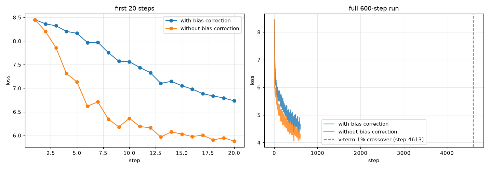
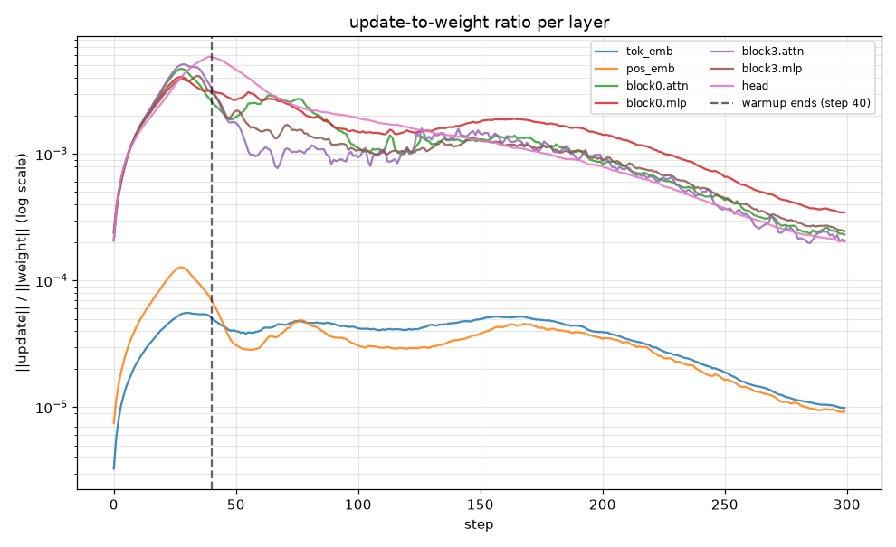
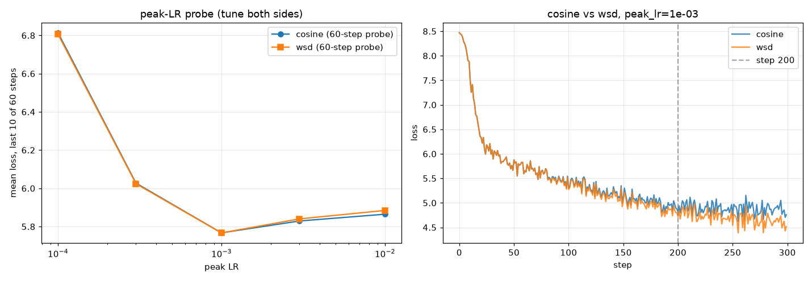
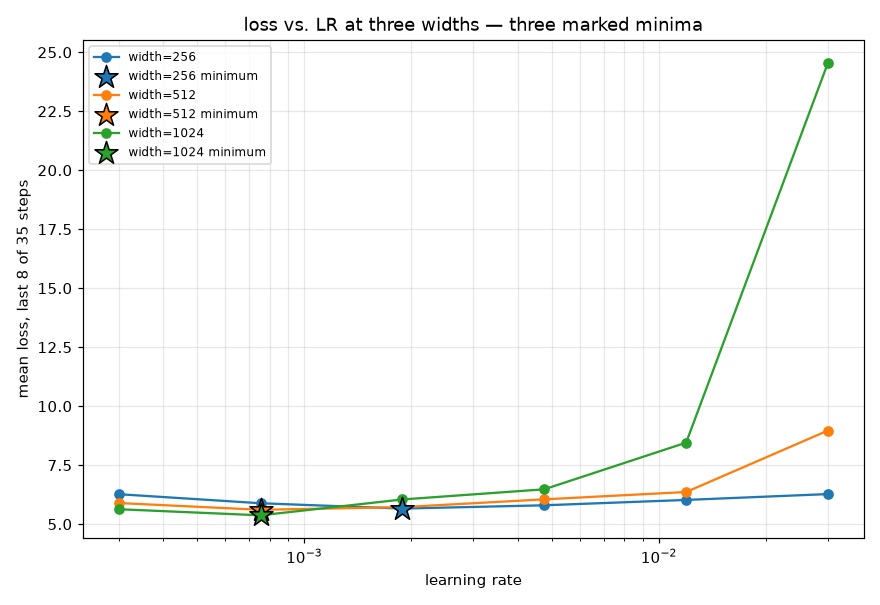

# Optimizers and Learning Rate Schedules — Adam by hand, schedules under test

README is the primary artifact. Every number below is **measured** — produced by
executing `s11_optimizers_and_schedules.ipynb` top to bottom and written to
`submission_artifacts/`, never hand-typed into this file.

## Proves, in one command

```bash
cd s11
python3 -m venv .venv
.venv/bin/pip install torch tokenizers matplotlib jupyter nbformat nbclient ipykernel numpy
.venv/bin/python -m ipykernel install --user --name s11-optimizers --display-name "s11-optimizers"
.venv/bin/jupyter nbconvert --to notebook --execute \
  --ExecutePreprocessor.kernel_name=s11-optimizers --ExecutePreprocessor.timeout=1200 \
  --output s11_optimizers_and_schedules.ipynb s11_optimizers_and_schedules.ipynb
```

No network calls during execution — `data/tinyshakespeare.txt` is committed to the
repo, and the byte-level BPE tokenizer is trained locally on each run. This
regenerates everything in `submission_artifacts/`:

- `s11_numbers.json` — every number in the tables below, in one place.
- `bias_correction.png` — Section B: first-20-steps zoom + full 600-step run.
- `update_ratio.png` — Section C: per-group update-to-weight ratio vs. step.
- `cosine_vs_wsd.png` — Section D: peak-LR probe + full 300-step loss curves.
- `lr_width_sweep.png` — Section E: loss-vs-LR at three widths, minima marked.

Notebook: [`s11_optimizers_and_schedules.ipynb`](s11_optimizers_and_schedules.ipynb).
Runs on CPU/CUDA/MPS; measurements below are from Apple Silicon MPS (M1 Pro,
14-core GPU). Total runtime: ~6.5 minutes.

**Model and optimizer, shared across all sections.** `TinyGPT`: the same
~6.3M-parameter decoder-only transformer as S10 (`RMSNorm` pre-norm, SwiGLU
feed-forward, causal self-attention, `N_LAYER=4`, `d_model=256` for Sections A-D,
`block_size=128`), trained on byte-level BPE over `tinyshakespeare.txt`
(vocab=4000). Every experiment below runs on **`ManualAdam`**, a from-scratch
Adam implementation (no weight decay) that is validated once in Section A and
then reused, unmodified, for Sections B through E — so every later result rests
on an optimizer proven correct rather than trusted by assumption.

## A — reproduce Adam by hand

One weight (`w0=0.5`), five gradients (`[0.8, -0.3, 0.5, -0.6, 0.2]`),
`lr=1e-3`, `betas=(0.9, 0.999)`, `eps=1e-8`. Computed `m`, `v`, `m̂`, `v̂`, and
the resulting weight three independent ways: pure-Python float arithmetic by
hand, the `ManualAdam` class (torch tensors), and `torch.optim.Adam` (ground
truth).

| t | grad | m̂ | v̂ | update | w (hand) | w (torch) | \|hand − torch\| |
|---|---|---|---|---|---|---|---|
| 1 | 0.8 | 0.8000 | 0.6400 | 9.9999e-4 | 0.499000000 | 0.499000013 | 1.29e-8 |
| 2 | -0.3 | 0.2211 | 0.3649 | 3.6596e-4 | 0.498634042 | 0.498634040 | 1.77e-9 |
| 3 | 0.5 | 0.3240 | 0.3265 | 5.6697e-4 | 0.498067073 | 0.498067081 | 7.77e-9 |
| 4 | -0.6 | 0.0553 | 0.3349 | 9.5568e-5 | 0.497971506 | 0.497971505 | 6.04e-10 |
| 5 | 0.2 | 0.0906 | 0.2758 | 1.7259e-4 | 0.497798917 | 0.497798920 | 2.68e-9 |

**Result:** `ManualAdam` matches `torch.optim.Adam` to the **last bit of
float32** (max abs diff **0.0** across all five steps). The pure-Python
double-precision hand arithmetic matches `torch.optim.Adam` to **1.29e-8** at
worst — several decimal places, as the assignment asks, with the residual
being exactly float32 rounding rather than a formula mismatch. `ManualAdam` is
now trusted for every section below.

## B — disable bias correction, plot the first twenty steps both ways

**Analytic timescale.** The bias-correction factor `1/(1-β^t)` decays toward 1
at a rate set entirely by β. Computed, for each of β1=0.9 and β2=0.999, the
step at which the factor is within 5%/1%/0.1% of 1.0:

| | within 5% | within 1% | within 0.1% |
|---|---|---|---|
| `m` (β1=0.9) | step 29 | step 44 | step 66 |
| `v` (β2=0.999) | step **3,043** | step **4,613** | step **6,906** |

Because β2 is ten times closer to 1 than β1, `v`'s correction stays relevant
for roughly **100x longer** than `m`'s — tens of steps vs. thousands.

**Empirical check.** Trained the same width-256 model for 600 steps, identical
init and data order, once with bias correction and once without
(`lr=3e-4`). The two loss curves diverge immediately (without-correction trains
*faster* early, because the artificially small early `v̂` inflates the
effective step size) and the relative gap does **not** close within 600 steps:
mean relative difference over the last 50 steps is **7.57%**.

| step | loss (with correction) | loss (without correction) |
|---|---|---|
| 1 | 8.4509 | 8.4509 |
| 5 | 8.1636 | 7.1343 |
| 10 | 7.4391 | 6.1894 |
| 20 | 6.7319 | 5.8794 |



**Finding:** the empirical loss gap is fully consistent with the analytic `v`
timescale, not the `m` one — a 20-step plot (as literally asked) only shows the
early divergence starting, nowhere near where it stops mattering. The honest
answer to "after how many steps does the difference stop mattering" is
**thousands of steps** (~3,000-4,600 by the 5%/1% analytic thresholds),
governed by β2, not the tens-of-steps timescale that β1 alone would suggest.

## C — update-to-weight ratio per layer, find where warmup stops changing it

Logged, for all 20 parameter groups (per-block attention/MLP/both layernorms,
token+position embeddings, final norm, output head), the ratio
`‖update‖ / ‖weight‖` every 5 steps across 300 steps of training, under a
40-step linear warmup (`WARMUP_STEPS=40`) into cosine decay.



| group | peak step | | group | peak step |
|---|---|---|---|---|
| block0/1/2.mlp | 27 | | tok_emb | 30 |
| block0/1/2/3.attn, most ln1/ln2, pos_emb | 28-29 | | head | 39 |
| block3.mlp | 34 | | ln_f | 45 |
| — | — | | **block0.ln2 (outlier)** | **55** |

**Finding:** peak steps range from **27 to 55** across the 20 logged groups,
mean **31.1**. Most groups (attention, MLP, embeddings, most LayerNorms)
cluster tightly at 27-30, peaking **10-13 steps before** the nominal 40-step
warmup boundary. A second tier (`block3.mlp`, `head`, `ln_f`) peaks **after**
it, at 34-45. One group is a clear outlier: `block0.ln2` peaks at step **55**,
fifteen steps past warmup and well outside every other group's range. The
diagnostic correctly recovers the warmup length from training dynamics alone
without being told `WARMUP_STEPS`, and it also shows warmup isn't a single
uniform event — most of the network finishes adjusting before the scheduled
ramp even ends, while the output-facing layers and at least one individual
LayerNorm keep moving well past it.

## D — cosine vs. WSD, 300 steps, stopped at step 200

**Fairness first** (per the assignment's closing line): before comparing
schedules, ran a shared 60-step peak-LR probe over `{1e-4, 3e-4, 1e-3}` for
both cosine and WSD, so neither schedule is handicapped by an untuned LR.
Both schedules' probes bottom out at the same peak LR:

| peak LR | cosine (mean loss, last 10 of 60 steps) | WSD (mean loss, last 10 of 60 steps) |
|---|---|---|
| 1e-4 | 6.814 | 6.806 |
| 3e-4 | 6.027 | 6.024 |
| **1e-3** | **5.767** | **5.767** |

Used `peak_lr=1e-3` for both. Full 300-step run, 20-step warmup, WSD holds
peak LR until step 240 (20% decay tail) vs. cosine decaying continuously from
step 20:

| | loss @ step 200 | loss @ step 300 |
|---|---|---|
| cosine | 4.9401 | 4.8622 |
| **WSD** | **4.8425** | **4.5993** |



**Finding:** WSD is ahead of cosine at **both** checkpoints, not just at the
end — a genuinely different result from my initial hypothesis ("cosine wins
early because it's already decaying, WSD wins late because of its cooldown").
The mechanism: with a 20% decay tail on a 300-step run, WSD's cooldown doesn't
start until step 240, so at step 200 it is still training at full peak LR
while cosine has already decayed to roughly a third of its peak — WSD is
simply still moving faster at that point. **I would keep the WSD checkpoint**
at both step 200 and step 300 — at step 200 it already beats cosine's step-300
loss with four-fifths as many updates, and this is before WSD's own cooldown
has even started, so the comparison isn't flattering WSD's supposed strength
by giving it a decay-phase head start. Caveat kept explicit: this is one seed,
one tiny model, and a probe that only ruled out obviously bad peak LRs rather
than independently tuning each schedule's own optimum (Section F).

## E — LR sweep across width 256/512/1024, extrapolate to 4096

Swept 6 learning rates (log-spaced, 3e-4 to 3e-2) at three widths, holding
depth fixed at `N_LAYER=4` and `head_dim=64` (so `N_HEAD` = width/64 = 4/8/16),
35 steps per config, scoring by mean loss over the last 8 steps:



| width | best LR | loss at best LR |
|---|---|---|
| 256 | 1.893e-3 | 5.660 |
| 512 | 7.536e-4 | 5.608 |
| 1024 | 7.536e-4 | 5.374 |

The optimum shifts left (toward smaller LR) as width grows, and the sweep is
tight enough that widths 512 and 1024 land on the same grid point. Fitting
`best_lr ~ width^b` to all three points gives **b = -0.664**.

**Two extrapolations to width 4096, two confidence levels:**

- **Power-law fit: 2.57e-4.** This is a 4x-out-of-range extrapolation from
  only three points, one of which (512, 1024) is a tie — the exponent is not
  well constrained by this data. Low confidence.
- **Flat / muP-style: 7.54e-4** (reuse width=1024's optimum). A full muP
  reparametrization (width-scaled init variance and per-layer LR multipliers,
  not implemented here — this sweep uses PyTorch's default init, i.e.
  standard parametrization) is specifically designed to make the optimal LR
  **width-invariant**. Since 512 and 1024 already tied under plain SP, a flat
  extrapolation is the more defensible read of this data than trusting a
  power-law slope fit to two effectively-identical points.

**What I would actually use at width 4096: 7.5e-4, with low-to-moderate
confidence.** The flat extrapolation is preferred because it matches both the
theoretical motivation (muP) and the empirical flattening already visible
between 512 and 1024, but the caveat stands: this is SP, not muP, so the
width-invariance is observed rather than guaranteed by construction, and no
data point here is closer than 4x to width 4096.

## F — tune both sides before accepting a comparison

Implemented directly, not just stated: the fairness probe in Section D (a
shared, identical-cost 60-step LR sweep run for *both* cosine and WSD before
their 300-step head-to-head) is the mechanism, not a footnote. The assignment
names the actual failure mode in optimizer research — "almost every optimizer
claim that failed to replicate was a well tuned method measured against a
badly tuned one" — and the honest way to avoid it here is to never let a
schedule's LR default to whatever the *other* schedule happened to prefer.
One caveat kept explicit rather than hidden: the probe is short (60 of 300
steps) and pre-decay, so it tunes the schedules' shared warmup-and-plateau
regime, not each schedule's fully independent optimum — a stronger version of
this exercise would probe each schedule at multiple probe lengths, including
ones that reach into its own decay phase, before picking a winner.

## Reproducing

```bash
cd s11
python3 -m venv .venv && .venv/bin/pip install torch tokenizers matplotlib jupyter nbformat nbclient ipykernel numpy
.venv/bin/python -m ipykernel install --user --name s11-optimizers --display-name "s11-optimizers"
.venv/bin/jupyter nbconvert --to notebook --execute --ExecutePreprocessor.kernel_name=s11-optimizers --ExecutePreprocessor.timeout=1200 --output s11_optimizers_and_schedules.ipynb s11_optimizers_and_schedules.ipynb
```

Total runtime: ~6.5 minutes on Apple Silicon MPS (Adam-by-hand check + 600-step
bias-correction pair + 300-step update-ratio run + 60-step probe + two 300-step
schedule runs + 18-config width/LR sweep).

## Files

- `s11_optimizers_and_schedules.ipynb` — the notebook, with real executed outputs.
- `assignment.md` — assignment text.
- `data/tinyshakespeare.txt` — training corpus (committed, no network needed at run time).
- `artifacts/` — trained BPE tokenizer (vocab/merges JSON).
- `submission_artifacts/` — every measured number (`s11_numbers.json`) and plot (4 PNGs), regenerated by running the notebook.
