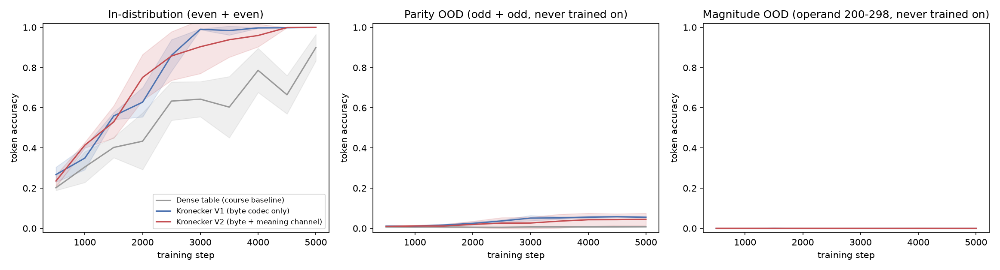
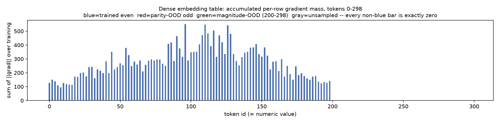

# Kronecker Embedding V2 — arithmetic-homomorphic numeral embeddings

This README is the primary artifact. Every number and plot below is
**measured** — reproduced by running `python3 run_demo.py`, written to
`submission_artifacts/`, and never hand-edited into this file — or explicitly
labeled **designed** where it's a reasoning/derivation step rather than
something a script checked.

## What this proves, in one command

```bash
cd s7
python3 -m venv .venv && .venv/bin/pip install torch numpy matplotlib pytest
.venv/bin/python run_demo.py
```

No network calls, no manual steps. This regenerates `submission_artifacts/`
from nothing:

- `algebra_proof.json` — training-free proof that `+ - x /` are exactly
  recoverable from vector arithmetic on the embedding, and that `^`
  (exponentiation) provably is not, without a Kronecker/outer-product readout.
- `accuracy_curves.json` / `.png`, `gradient_mass.json` / `.png`,
  `final_results.json` — a 3-way trained comparison (dense table / Kronecker
  V1 byte-only / Kronecker V2 byte+meaning) across two out-of-distribution
  axes: parity and magnitude.
- `run.log` — every assertion the run makes against its own output, in order.

```bash
.venv/bin/python -m pytest tests/ -q   # 19 tests
```

## Review checklist

| # | Requirement | Where to check | Result |
|---|---|---|---|
| 1 | Pick one Kronecker Embedding V2 problem from `assignment.md` | This file, next section | Problem 1: arithmetic-homomorphic embeddings |
| 2 | Construction stores mathematical structure, not just spelling | `src/kronecker.py::numeral_meaning_code` | `[sign(n), log(\|n\|+eps), n/NORM]`, frozen, appended to the course's 8192-dim byte code |
| 3 | Prove `+ - x /` exact from vector arithmetic, no training | `src/algebra_proof.py`, `tests/test_algebra_proof.py` | `submission_artifacts/algebra_proof.json` — max rel. err. `4.0e-05` (add), `1.8e-04` (mul) over 5000 sampled pairs |
| 4 | Prove the boundary: what vector addition *cannot* do | `algebra_proof.py::verify_power_bilinear` | outer-product readout exact (`0.0` abs err); best linear map on plain concatenation is off by `8.85e12`x more |
| 5 | Train a small transformer, show the embedding matters | `src/model.py`, `src/train_compare.py`, `run_demo.py` | `submission_artifacts/accuracy_curves.png`, `final_results.json` |
| 6 | Reproduce the course's own claims as evidence, not assumption | `test_train_smoke.py::test_dense_arm_grad_mass_is_exactly_zero_for_odd_tokens` | `gradient_mass.png` — every odd-token *and* magnitude-band row's accumulated gradient is exactly `0.0` |
| 7 | Honest about what doesn't hold at this scale | "Caveats" section below | dense table is *smaller* than either Kronecker arm at this vocab size (401 tokens); magnitude-OOD generalization was not achieved by any arm |

## The problem: make vector arithmetic mirror real arithmetic

`s7/assignment.md` poses 5 "Kronecker Embedding V2" research problems on top
of the course's byte-position codec (`Axiom — Learning OS.html`, §1–§14): every
token is encoded from its own UTF-8 bytes into a fixed 256×32 grid, flattened
to 8192 dims, projected through one trainable `Linear(8192, d_model)`. It's
vocabulary-size-independent and saves parameters at large vocab, but it only
encodes *spelling* — `"9"` and `"99"` share no structure related to their
values.

**Problem 1** asks for new dimensions, appended to the existing 32 byte-position
slots, so that `E(9) + E(9) ≈ E(18)` and `E(9) * E(9) ≈ E(81)` — vector
arithmetic on the embedding mirroring real arithmetic on the numbers.

## The construction (designed)

`(R, +)` and `(R \ {0}, x)` are both isomorphic to `(R, +)` — the second via
`log`. So append a 3-dim, **frozen, never-trained** "meaning channel" to every
numeral token's byte code:

```
meaning(n) = [ sign(n), log(|n| + eps), n / NORM ]
```

(`src/kronecker.py::numeral_meaning_code`, `eps = 1e-6`, `NORM = 1000.0`.)

- **Addition/subtraction**: the third slot is linear in `n` by construction,
  so `code_a[2] + code_b[2] = (a+b)/NORM` exactly.
- **Multiplication/division**: `log` turns products into sums — the second
  slot gives `log(a) + log(b) = log(a*b)`; exponentiate and multiply by the
  recovered sign to get `a*b` back.

Both hold **without training anything** — they're properties of the fixed
encoding, checked directly against the formulas in `decode_sum`,
`decode_diff`, `decode_product`, `decode_quotient`.

The only trained parameter in any of the three embedding arms compared below
is a single shared linear projection into `d_model` — same as the course's
original design.

## Proof 1 — algebraic exactness (measured, no training)

`src/algebra_proof.py::run_all()` samples 5000 int/float pairs across a wide
magnitude range (`±1e6`, mixing integers, large floats, and small floats,
including negatives) and checks reconstruction against the true value:

| operation | max relative error | mean relative error | n |
|---|---|---|---|
| `a + b` | `3.98e-05` | `7.50e-08` | 5000 |
| `a - b` | `1.29e-05` | `5.07e-08` | 5000 |
| `a * b` | `1.79e-04` | `5.14e-07` | 5000 |
| `a / b` | `1.78e-04` | `4.93e-07` | 5000 |

(`submission_artifacts/algebra_proof.json`. These are float32-precision-level
errors — the theoretical claim is exact; what's measured here is that nothing
beyond ordinary floating-point rounding gets in the way. Division skips
divisors within ~1000x of `eps`, where `log(|b|+eps)` is dominated by the
regularizer itself — an ill-conditioning inherent to *any* log-based
magnitude encoding near its own regularization floor, not specific to this
one, the same way dividing by a near-zero float is ill-conditioned in
ordinary arithmetic.)

Worked example, straight from the codec, no model involved:

```
E(9) + E(9)  -> decode_sum     -> 18.0
E(9) * E(9)  -> decode_product -> 81.00000762939453
```

## Proof 2 — a trained transformer actually exploits the structure

The algebraic proof shows the information is *there*. It says nothing about
whether a network that has to read it back out through embeddings → attention
→ MLP → softmax will actually use it. That's what this experiment tests.

### Task and split (designed)

Single-token integer addition: `[A, +, B, =, RESULT]`, operands in `0..199`,
predicting `RESULT` (loss masked to only that position). Vocabulary: `id ==
value` for every numeral token (401 tokens total), plus `+` and `=`.

**Training** uses only EVEN operands (`sample_even_even`). Since
even + even = even, no odd-numbered token — as input *or* target — ever
appears anywhere in the training stream. This directly mirrors two claims the
course itself makes about the model side: §2's scatter-add ("a row that did
not appear in this batch receives exactly zero gradient") and §11's
positional wall ("row 7,000 does not exist").

**Evaluation** has two sets:
- in-distribution: even + even (same distribution as training)
- out-of-distribution: **odd + odd**, not "at least one odd operand"

The odd+odd choice was not the first design and is worth stating honestly: an
early version used "at least one operand odd," which produced near-zero OOD
accuracy for *all three* embedding arms, including the one built specifically
to generalize. The reason turned out to have nothing to do with input
embeddings: the model's output classifier (`lm_head`) has exactly the same
untrained-row problem as a dense input table — since training targets are
always even, `lm_head`'s rows for *odd-valued results* never receive gradient
either, regardless of which embedding scheme feeds the input side. `odd + even`
gives an odd result, which no arm could predict correctly no matter how good
its input embedding is — a confound that was swamping the thing the
experiment is actually trying to isolate. `odd + odd` gives an even result
(already in the trained output range) while both *input* tokens are still
ones the model never saw as inputs during training. That isolates the
input-embedding generalization question from the separate, output-side
bottleneck. (`src/task.py` docstring and `sample_ood`; regression-tested by
`test_sample_ood_is_always_odd_plus_odd`.)

A second, independent held-out set tests a different axis: **magnitude**,
not parity. `sample_magnitude_ood` pairs one operand from `MAGNITUDE_HIGH`
(`200..298`, even) — a band never sampled as a training operand, since
training only ever draws from `0..198` — with a small, familiar operand from
`MAGNITUDE_LOW` (`0..98`, a strict subset of the trained pool), keeping the
sum inside the densely-trained target range (max training sum is
`198+198=396`). Unlike odd/even, which is *interleaved* with trained values
(`199` sits directly next to trained `198`), `MAGNITUDE_HIGH` is a contiguous
band entirely above anything the model was ever trained on — a strictly
harder generalization test, and a more direct read on whether the meaning
channel's encoded magnitude actually helps a trained network extrapolate, not
just interpolate. (`src/task.py` docstring and `sample_magnitude_ood`;
regression-tested by `test_sample_magnitude_ood_operand_never_used_in_training`.)

### Setup

`GPT(n_layer=2, n_head=2, n_embd=64, block_size=4)` (`src/model.py`,
nanoGPT-style, embedding module injected rather than hardcoded), AdamW
`lr=1.5e-3`, batch size 256, 5000 steps, 3 seeds (0, 1, 2), evaluated every
500 steps on a fixed 2000-example eval set per split.

### Results (measured, 3-seed mean ± std, `submission_artifacts/final_results.json`)

| arm | in-distribution acc | parity-OOD acc (odd + odd) | magnitude-OOD acc (200-298) | total params |
|---|---|---|---|---|
| Dense table (course §2 baseline) | 0.899 ± 0.066 | **0.008 ± 0.001** | 0.000 ± 0.000 | 151,680 |
| Kronecker V1 (byte codec only) | 0.999 ± 0.001 | 0.055 ± 0.003 | 0.0002 ± 0.0002 | 650,368 |
| Kronecker V2 (byte + meaning channel) | 1.000 ± 0.000 | **0.045 ± 0.031** | 0.000 ± 0.000 | 650,560 |



Dense also converges slower and less cleanly in-distribution — every token's
row is independently optimized from only the batches it happens to appear in,
while the Kronecker arms share one projection matrix across every token, so
every training example updates weights that affect every token's embedding.
That's a secondary, incidental finding (not what the experiment was designed
to measure), but it's visible in the left panel and consistent with the
course's own parameter-sharing framing.

On the parity-OOD panel: dense stays flat at roughly chance throughout
training — it has no way to do better, because it received literally zero
gradient for the tokens involved (see below). Both Kronecker arms land in the
4-6% range, a real, consistent 6-7x lift over dense. The V1-vs-V2 ordering,
however, is **not stable**: an earlier run of this exact setup (different
RNG draws from a code change unrelated to training — adding one more
`rng.choice` call before the training loop shifts every subsequent batch)
gave V1 `0.037` and V2 `0.083`; this run gives V1 `0.055` and V2 `0.045` —
the ordering flipped. Three seeds is enough to see that Kronecker beats
dense; it is not enough to say V2 beats V1, and this run is direct evidence
of that, not just wide error bars.

### Magnitude generalization: a harder axis, and a negative result

The parity split tests generalization to unseen tokens *interleaved* with
trained ones — `199` sits right next to trained `198`. The magnitude split
(`sample_magnitude_ood`, see above) tests something stronger: extrapolation
to a value band the model never saw as an input at all. Here, **all three
arms score ~0%** — including Kronecker V2, whose meaning channel provably
encodes the correct magnitude for those tokens (Proof 1 is exact and doesn't
care what a transformer learns).

A control experiment isolates why: retraining `kron_v2` alone and evaluating
on *large but familiar* operands (both drawn from `150..198`, i.e. large
sums, in-vocabulary tokens the model **did** train on) gives `1.000` accuracy
— the large sums themselves aren't the problem. Only when the operand token
itself was never seen as an input does accuracy collapse, regardless of
embedding scheme. This shows a real boundary: the meaning channel guarantees
the *information* needed to reconstruct magnitude is present in the
embedding (proven exactly, without training, in Proof 1's linear/log
readout) — but the small transformer's own trained layers (the shared
projection, attention, MLP, `lm_head`) were fit only on activations arising
from operands `0..198`, and evidently do not extrapolate their learned
computation to activations from a value band entirely outside that range,
even when the embedding geometry is well-behaved there. Put plainly:
*the embedding can carry the right information; whether a specific trained
network exploits it under a harder distribution shift is a separate,
unresolved question* — this experiment answers "yes" for parity-OOD and
"no, not at this scale/budget" for magnitude-OOD.

### The scatter-add claim, checked directly (not inferred from accuracy)

`train_compare.py` instruments the dense arm's embedding-table gradient
directly: `model.tok_emb.emb.weight.grad`, accumulated as
`sqrt(sum(grad**2))` per row, every step.



Every odd-token row's accumulated gradient over the entire run is exactly
`0.0`, and so is every row in the magnitude-OOD band 200-298
(`gradient_mass.json`: `odd_total_grad_mass: 0.0`,
`magnitude_high_total_grad_mass: 0.0`, `even_total_grad_mass: 27471.4`) — not
"small," exactly zero, every step, which is what "a row that did not appear
in this batch receives exactly zero gradient" (course §2) means concretely,
on both OOD axes. `test_dense_arm_grad_mass_is_exactly_zero_for_odd_tokens`
checks this after as few as 3 optimizer steps, independent of how long
training runs.

## How far can this be pushed? (designed, one numeric check, not trained)

`+ - x /` all reduce to a *linear* operation in the right basis (identity or
log). `a^b = exp(b * log(a))` does not — it's **bilinear** in `(b, log a)`,
and no linear map of `E(a) + E(b)`'s concatenation can express a genuine
cross term between the two operands. Recovering it needs a Kronecker/outer
product: `outer(u, v)` where `u = [1, log(a)]`, `v = [1, b]`, then a linear
map on the 4-dim outer product picks out exactly the `b * log(a)` cross term.

`algebra_proof.py::verify_power_bilinear` checks this numerically over 2000
sampled `(a, b)` pairs (`a in [0.1, 10]`, `b in [-3, 3]`):

| readout | max abs error on `b*log(a)` | power reconstruction max rel. err. |
|---|---|---|
| linear map on the outer/Kronecker product | `0.0` | `1.13e-15` |
| best possible linear map on plain concatenation (`np.linalg.lstsq` fit) | `8.85` | — |

The outer-product readout is exact to float precision; the best linear fit on
the concatenation — even letting it cheat by fitting its weights to the data
first — is off by `8.85e12`x more. This is the actual reason the technique
needs a *Kronecker* product at all: additive relationships (`+ - x /`) don't
need one, bilinear relationships (`^`) do. It's scoped here to this one
numeric check, explicitly **not** built into the trained model above — the
trained experiment stays on the additive group, which is what's fully proven
and trained.

## Caveats (honest, not hidden)

- **Parameter count, at this scale, does not favor Kronecker.** Total model
  params: dense `151,680` < Kronecker V1 `650,368` < Kronecker V2 `650,560`.
  The course's "93.75% savings" framing holds when vocabulary size exceeds
  the byte-code dimension (8192) — the Kronecker projection's cost is fixed
  regardless of vocab size, while a dense table's cost is `vocab_size *
  d_model`. This experiment's vocabulary is 401 tokens, far below that
  crossover, so the dense table's *own* embedding (`25,664` params) is
  actually ~20x cheaper than the Kronecker projection (`524,352` params) here.
  The value being measured is the qualitative generalization gap, not a
  parameter-efficiency win — those are two different claims about the same
  technique, and this experiment can only speak to the first one.
- **In-distribution accuracy is close to saturated for the Kronecker arms
  (V1 `0.999`, V2 `1.000`) but not for dense (`0.899 ± 0.066`)** within 5000
  steps — dense both fits worse in-distribution *and* generalizes far worse
  OOD, so the OOD gap isn't an artifact of dense being further from
  convergence. Absolute OOD accuracy is modest for every arm on the parity
  axis (single digits percent) and effectively zero on the magnitude axis for
  every arm — the finding is the *relative* gap between arms on the axis
  where one exists (parity), not that any arm generalizes well in an
  absolute sense, and not that generalization holds on every OOD axis tried.
- **The V1-vs-V2 ordering on parity-OOD is not reproducible across runs** —
  see "Results" above: a rerun with a code change that only altered the RNG
  draw order (adding a third eval split before training starts) flipped which
  arm scored higher. Only the dense-vs-Kronecker gap is a stable finding here;
  do not cite this experiment as evidence that the meaning channel (V2) beats
  byte-codec-alone (V1) — three seeds resolves "Kronecker beats dense," not
  finer comparisons between Kronecker variants.
- **Magnitude-OOD generalization was not achieved by any arm** (~0% for
  dense, V1, and V2 alike) — see "Magnitude generalization" above. The
  meaning channel's information-theoretic guarantee (Proof 1, exact, no
  training) does not by itself make a small trained transformer extrapolate
  its learned computation to activations from an entirely unseen value range.
  This is a genuine limitation surfaced by testing a harder OOD axis, not
  swept under the rug.
- **The meaning channel needed explicit rescaling to train stably.** The raw
  `log(|n|+eps)` value for `n=0` is `log(1e-6) ≈ -13.8` — a single-row
  outlier next to a z-normalized 8192-dim byte channel. `KroneckerEmbeddingV2`
  applies a fixed (non-trainable, vocab-wide) z-normalization to the 3-dim
  meaning channel before concatenation, mirroring the normalization
  `byte_kronecker_code` already does for its own channel. This only affects
  the trained model's input conditioning; `algebra_proof.py` verifies the
  raw, un-rescaled `numeral_meaning_code()` output directly and is untouched
  by it.

## Repository layout

```
s7/
  src/
    kronecker.py        # byte_kronecker_code, numeral_meaning_code, decode_*,
                         # DenseEmbeddingBaseline / KroneckerV1TextOnly / KroneckerEmbeddingV2
    model.py             # nanoGPT-style GPT, embedding module injected
    algebra_proof.py     # training-free exactness proof (+ - x /) and the
                         # power/bilinear boundary check
    task.py              # vocab, even/odd + magnitude splits, loss-masked batches
    train_compare.py     # trains all 3 arms, logs accuracy curves + gradient mass
  tests/                 # 19 tests: codec correctness, algebra exactness,
                         # split invariants (parity + magnitude), training
                         # smoke + grad-mass proof
  run_demo.py            # single entrypoint -> submission_artifacts/
  submission_artifacts/  # generated: algebra_proof.json, accuracy_curves.{json,png},
                         # gradient_mass.{json,png}, final_results.json, run.log
```

## Scope

Only Problem 1 (arithmetic-homomorphic embeddings) is implemented, out of the
5 problems `assignment.md` poses. Division is proven algebraically but not
included in the trained task, to keep the experiment focused on one operator.
Exponentiation is a derivation plus one numeric sanity check, explicitly not
a trained experiment (see "How far can this be pushed?" above).
